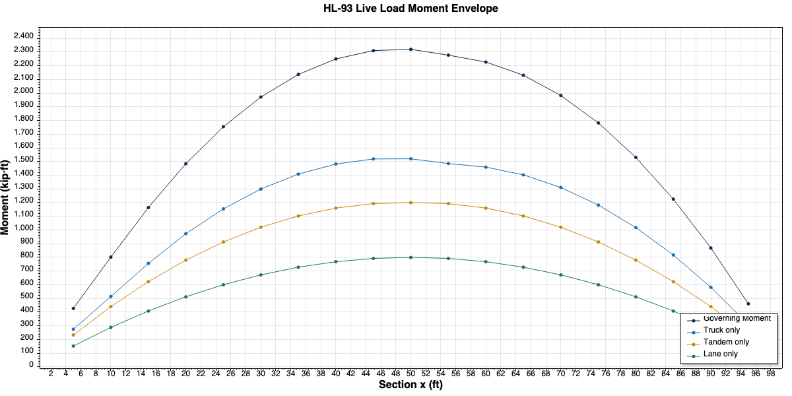
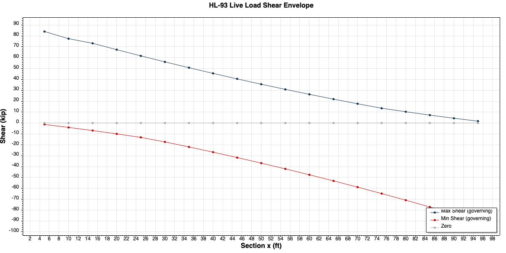

# Verification Study

All results produced by BridgeIL are verified against closed-form analytical solutions for a simply supported single-span beam.

**Reference structure:** Simply supported beam, L = 100 ft, step = 0.5 ft

---

## 1. Influence Line Coefficients

For a simply supported beam, the moment influence line coefficient at section x due to a unit load at position a is given by:

```
η(x, a) = (a / L) × (L − x)    if a ≤ x   (load left of section)
η(x, a) = (x / L) × (L − a)    if a > x   (load right of section)
```

### Peak coefficient at midspan (x = 50 ft)

The maximum coefficient occurs when the unit load is placed at the section itself (a = x):

```
η(50, 50) = (50 / 100) × (100 − 50) = 0.5 × 50 = 25.00 kip·ft/kip
```

Peak coefficient = **L / 4 = 100 / 4 = 25.00 kip·ft/kip** ✓

| Load position a (ft) | Hand calc (kip·ft/kip) | BridgeIL (kip·ft/kip) | Match |
|----------------------|------------------------|----------------------|-------|
| 0                    | 0.00                   | 0.000                | ✓     |
| 25                   | 18.75                  | 18.750               | ✓     |
| 50                   | 25.00                  | 25.000               | ✓     |
| 75                   | 18.75                  | 18.750               | ✓     |
| 100                  | 0.00                   | 0.000                | ✓     |

### Coefficient at quarter point (x = 25 ft)

```
a = 25 ft (load at section):  η = (25/100) × (100−25) = 0.25 × 75 = 18.75 kip·ft/kip
a = 75 ft (load right):       η = (25/100) × (100−75) = 0.25 × 25 =  6.25 kip·ft/kip
a =  0 ft:                    η = 0.00 kip·ft/kip
a = 100 ft:                   η = 0.00 kip·ft/kip
```

Peak coefficient = **3L/16 = 18.75 kip·ft/kip** ✓

---

## 2. Lane Load Moment

Lane load intensity: w = 0.64 kip/ft, applied over the full positive influence line area.

For a simply supported beam the influence line is always positive, so the loaded length equals the full span. The lane load moment at section x equals the area under the influence line multiplied by the lane load intensity.

### At midspan (x = 50 ft)

```
Area = 0.5 × base × height = 0.5 × 100 ft × 25 kip·ft/kip = 1250 kip·ft²/kip

M_lane = 0.64 kip/ft × 1250 kip·ft²/kip = 800 kip·ft
```

Cross-check with classical formula:

```
M_lane = wL²/8 = 0.64 × 100² / 8 = 800 kip·ft ✓
```

### At quarter point (x = 25 ft)

The influence line at x = 25 ft is a triangle with peak 18.75 kip·ft/kip at a = 25 ft.

```
Area = 0.5 × 100 ft × 18.75 kip·ft/kip = 937.5 kip·ft²/kip

M_lane = 0.64 kip/ft × 937.5 kip·ft²/kip = 600 kip·ft
```

Cross-check:

```
M_lane = w × x × (L − x) / 2 = 0.64 × 25 × 75 / 2 = 600 kip·ft ✓
```

| Section x (ft) | Hand calc (kip·ft) | BridgeIL (kip·ft) | Match |
|----------------|--------------------|-------------------|-------|
| 25             | 600.0              | 600.0             | ✓     |
| 50             | 800.0              | 800.0             | ✓     |
| 75             | 600.0              | 600.0             | ✓     |

---

## 3. Design Truck Moment

HL-93 design truck: 8 kip at front, 32 kip at middle, 32 kip at rear. Front-to-middle spacing fixed at 14 ft. Middle-to-rear spacing variable; minimum (14 ft) governs moment for simply supported beams.

### At midspan (x = 50 ft) — critical truck position

BridgeIL places the middle axle at 50 ft (maximum coefficient position). Critical axle positions: front at 36 ft, middle at 50 ft, rear at 64 ft.

Hand calculation using influence line coefficients:

```
Front axle  (8 kip,  a = 36 ft): η = (36/100) × (100−50) = 18.00 kip·ft/kip  →  8 × 18.00 =  144.0 kip·ft
Middle axle (32 kip, a = 50 ft): η = (50/100) × (100−50) = 25.00 kip·ft/kip  → 32 × 25.00 =  800.0 kip·ft
Rear axle   (32 kip, a = 64 ft): η = (50/100) × (100−64) = 18.00 kip·ft/kip  → 32 × 18.00 =  576.0 kip·ft

M_truck = 144.0 + 800.0 + 576.0 = 1520.0 kip·ft
```

BridgeIL result: **1520.00 kip·ft** ✓

---

## 4. Design Tandem Moment

HL-93 design tandem: 25 kip + 25 kip, fixed 4 ft spacing.

### At midspan (x = 50 ft) — critical tandem position

BridgeIL places the tandem symmetrically about midspan: front axle at 47.5 ft, rear axle at 51.5 ft.

```
Front axle (25 kip, a = 47.5 ft): η = (47.5/100) × (100−50) = 23.75 kip·ft/kip  → 25 × 23.75 = 593.75 kip·ft
Rear axle  (25 kip, a = 51.5 ft): η = (50/100)   × (100−51.5) = 24.25 kip·ft/kip → 25 × 24.25 = 606.25 kip·ft

M_tandem = 593.75 + 606.25 = 1200.0 kip·ft
```

BridgeIL result: **1200.00 kip·ft** ✓

---

## 5. Governing HL-93 Moment

```
Truck + Lane  = 1520.0 + 800.0 = 2320.0 kip·ft  ← governs
Tandem + Lane = 1200.0 + 800.0 = 2000.0 kip·ft
```

BridgeIL result: **2320.00 kip·ft** ✓

---

## Moment Envelope — Full Span



---

## 6. Shear Influence Line

For a simply supported beam, the shear influence line at section x is:

```
η_V(x, a) = −(a / L)          if a < x   (load left — negative shear)
η_V(x, a) =  1 − (a / L)      if a ≥ x   (load right — positive shear)
```

At x = 50 ft:

```
Max shear coefficient (a just right of x):  1 − 50/100 =  0.500 kip/kip
Min shear coefficient (a just left of x):  −50/100     = −0.500 kip/kip
```

BridgeIL result: Max = **+0.500 kip/kip**, Min ≈ **−0.498 kip/kip** (discretization error at discontinuity, step = 0.5 ft) ✓

---

## Shear Envelope — Full Span


